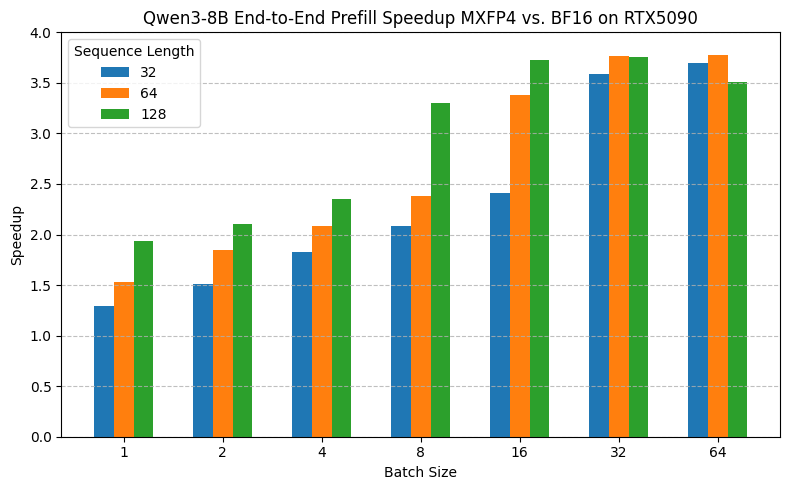
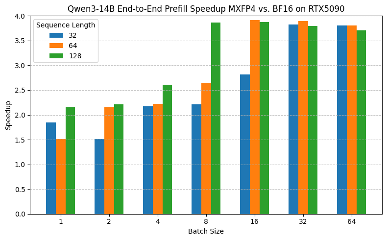
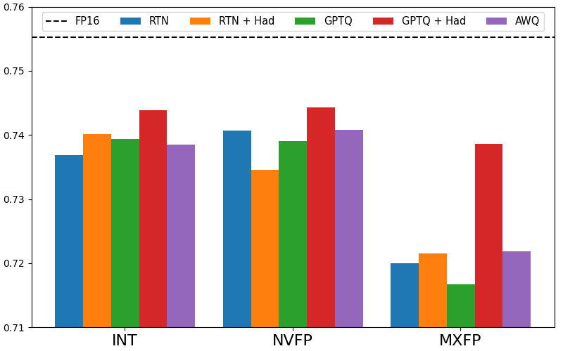
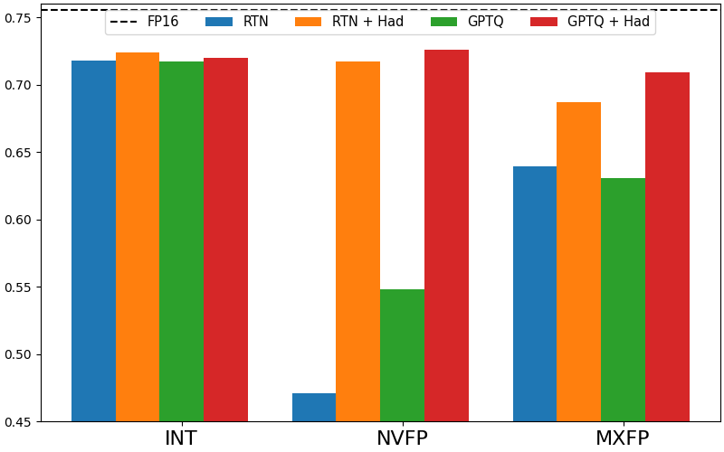
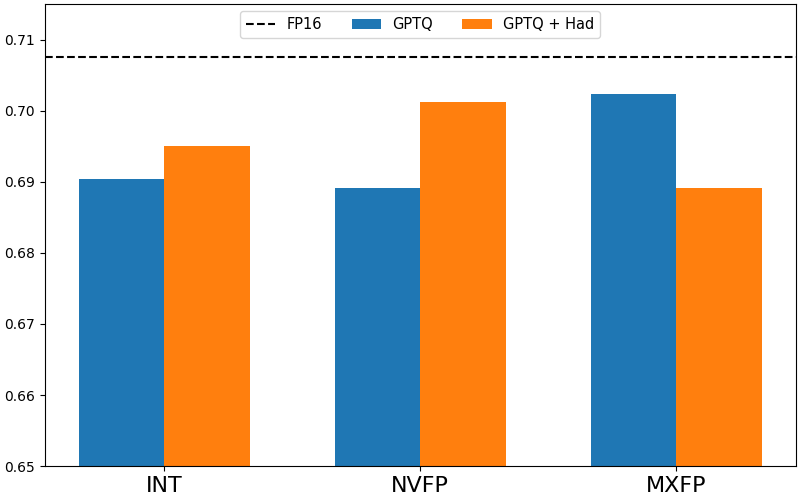
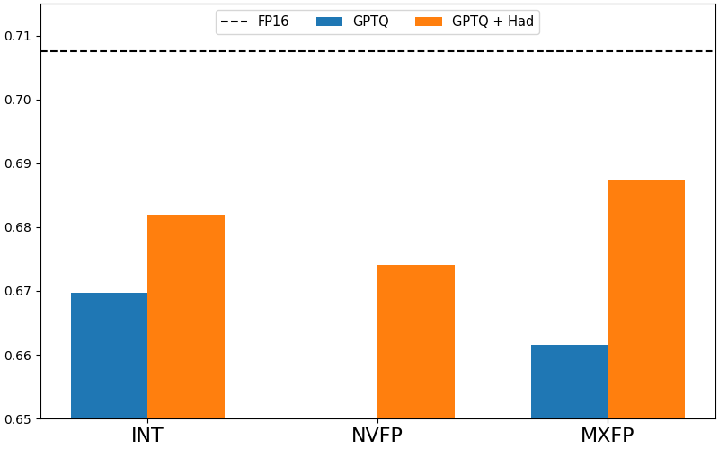

# FP Format Quantization Harness

This is a harness for efficient and accurate weight-and-activation quantization for low-bit FP/INT formats, with and without microscaling, including FP4, NVFP4, and MXFP. These formats are compatible with the NVIDIA Blackwell GPU architecture. 
The inference code to run models in the `MXFP` format can be found in the [QuTLASS](https://github.com/IST-DASLab/qutlass) repository. 

### Repository structure
---

The repository is structured as follows:

* `model_quant.py` - the main script for quantization of Llama/Qwen models
* `src/` - source code with implementation of all necessary functionality \
    ```├── quantization``` - quantization functionality \
    ```├── transforms``` - transform functionality \
    ```├── utils``` - utility functions


### Usage
---

Below is an example of the model quantization script usage:

```shell
MODEL=${MODEL:-"meta-llama/Llama-3.1-8B-Instruct"}
# Quantization params
FORMAT=${FORMAT:-"nvfp"}
W_BITS=${W_BITS:-4}
A_BITS=${A_BITS:-16}
W_GROUP_SIZE=${W_GROUP_SIZE:-16}
A_GROUP_SIZE=${A_GROUP_SIZE:-16}
GPTQ=${GPTQ:-0}
W_OBSERVER=${W_OBSERVER:-"minmax"}
QUANTIZATION_ORDER=${QUANTIZATION_ORDER:-"default"}
# Transform params
TRANSFORM_CLASS=${TRANSFORM_CLASS:-"identity"}
# Evaluation params
EVAL_PERPLEXITY=${EVAL_PERPLEXITY:-1}
EVAL_OPENLLM=${EVAL_OPENLLM:-0}
# Misc params
LOG_WANDB=${LOG_WANDB:-0}
DTYPE=${DTYPE:-"auto"}

SCRIPT_ARGS=""

if [[ $GPTQ == 1 ]]; then
    SCRIPT_ARGS="${SCRIPT_ARGS} --gptq"
fi

if [[ $EVAL_PERPLEXITY == 1 ]]; then
    SCRIPT_ARGS="${SCRIPT_ARGS} --eval_perplexity"
fi

if [[ $EVAL_OPENLLM == 1 ]]; then
    SCRIPT_ARGS="${SCRIPT_ARGS} --eval_openllm"
fi

if [[ $LOG_WANDB == 1 ]]; then
    SCRIPT_ARGS="${SCRIPT_ARGS} --log_wandb"
fi

METHOD_NAME=""
if [[ $GPTQ == 1 ]]; then
    METHOD_NAME="GPTQ"
else
    METHOD_NAME="RTN"
fi

export WANDB_ENTITY=<fill>
export WANDB_PROJECT=<fill>

if [[ $W_BITS == 16 ]]; then
    export WANDB_NAME=${MODEL}
else
    export WANDB_NAME=${MODEL}/${FORMAT}-w${W_BITS}g${W_GROUP_SIZE}-a${A_BITS}g${A_GROUP_SIZE}-${METHOD_NAME}-${TRANSFORM_CLASS}-transform
    SCRIPT_ARGS="${SCRIPT_ARGS} --save_path quantized_models/${MODEL_ID}-${FORMAT}-w${W_BITS}g${W_GROUP_SIZE}-a${A_BITS}${A_GROUP_SIZE}-${METHOD_NAME}-${TRANSFORM_CLASS}-transform"
fi

python model_quant.py \
    --model_name_or_path=${MODEL} \
    --format=${FORMAT} \
    --w_bits=${W_BITS} \
    --a_bits=${A_BITS} \
    --w_group_size=${W_GROUP_SIZE} \
    --a_group_size=${A_GROUP_SIZE} \
    --transform_class=${TRANSFORM_CLASS} \
    --w_observer=${W_OBSERVER} \
    --quantization_order=${QUANTIZATION_ORDER} \
    $SCRIPT_ARGS \
    --hadamard_group_size=${HADAMARD_GROUP_SIZE} \
    --dataset_name_or_path=c4 \
    --sequence_length=2048 \
    --dtype=${DTYPE} \
    --amp
```

Above:
* `--model_name_or_path` - The model to quantize. (currently only Llama and Qwen models are supported)
* `--format` - The quantization format.
* `--w_bits` - The number of bits to quantize the weights to.
* `--a_bits` - The number of bits to quantize the activations to.
* `--w_group_size` - The number of weights to quantize together.
* `--w_observer` - The observer to use for the weights (`mse` or `minmax`).
* `--a_group_size` - The number of activations to quantize together.
* `--parametrization` - Transform parameterization.
* `--gptq` - Whether to use GPTQ quantization.
* `--transform_class` - Transform class (`identity` or `hadamard`).
* `--dataset_name_or_path` - Dataset to use.
* `--sequence_length` - Sequence length.
* `--dtype` - Data type to load the model.
* `--amp` - Use automatic mixed precision.
* `--save_path` - Path to save the quantized model.
* `--real_quant` - Whether to save model in real quantization format.
* `--eval_perplexity` - Whether to compute perplexity.
* `--eval_openllm` - Whether to compute OpenLLMv1 scores.

`real_quant` option produces models that are runnable on Blackwell architectures (`sm_120`) via transformers and vLLM (currently using the transformers [fork](https://github.com/huggingface/transformers/pull/38696/)).

### Infererence speedup

Below we provide numbers for end-2-end inference with QuTLASS kernels vs `bf16` baseline for Qwen3 models.


<p float="left">
  
  
</p>


### Evaluation

The results below provide the evaluation results for quantized Llama-3 and Qwen-3 models 
on the OpenLLM v1 leaderboard. Specifically, we provide average metrics for the following tasks:
* `mmlu_cot_llama` (exact_match, strict_match)
* `arc_challenge_llama` (exact_match, strict_match)
* `gsm8k_llama` (exact_match, strict_match)
* `hellaswag` (acc_norm)
* `winogrande` (acc)
* `truthfulqa_mc2` (acc)

The results for Qwen3 exclude `arc_challenge_llama` as it turns out to be very noisy. 

Below left column corresponds to **weight-only** quantization, right column corresponds to **weight-and-activation** quantization. Results for AWQ were produced via the dedicated [AutoAWQ fork](https://github.com/Godofnothing/AutoAWQ-FP).

**Llama-3.1-8B-Instruct**

<p float="left">
  
  
</p>

**Qwen-3-8B**

<p float="left">
  
  
</p>

*Note*. For NVFP format without `hadamard` rotation GPTQ's average performance is below 0.65.  